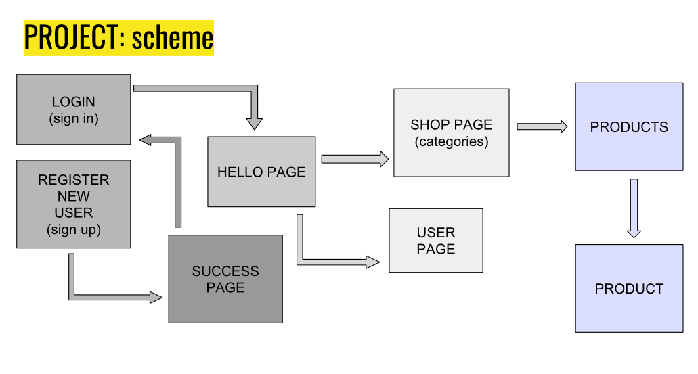

# OK_store
  # About
This Github repository - single page aplication to overview and administration goods and categories.
  # Installation
Clone repository
   `git clone https://github.com/Bellisa/OK_store.git`

Go to project folder and make npm i

Run npm start . Server is available on http://localhost:3000/

Check route http://localhost:3000

